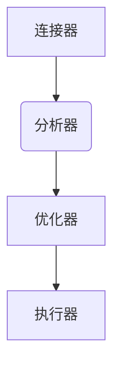

**架构简单分为 Server层 和 存储引擎层**

# server层

	1. 连接器
	2. 查询缓存
	3. 分析器
	4. 优化器
	5. 执行器

## 连接器

连接成功后获得用户的权限信息.只要连接成功之后一直保持连接,在本次连接中所进行的所有操作都不会再检查权限.
**即使在此期间更高权限的用户更改了这个用户的权限!**

长时间停留不操作将进入空闲状态.
最长停留时间由参数 wait_timeout 控制的，默认值是 8 小时.
全部使用长连接将会导致内存暴增.太大会被系统杀掉OOM.
解决办法:
	1. 定期断开长连接,然后重连.
	2. 5.7版本以后版本执行mysql_reset_connection.

## 查询缓存

连接器先在此查询,如果命中则直接返回结果.
尽量不要使用查询缓存.因为频繁失效.
8.0版本后不在支持查询缓存.

*tips:返回结果的时候会做权限查询*

## 分析器

分析器中会对语法进行分析,也会根据表的属性结构来分析.
*如果你查询的属性不存在,则这里直接返回错误*
当你给的语句出错时,注意 **"use near"** 关键字标注的地方

## 优化器

多个索引时,决定使用哪个索引.
多个优化操作从而使得效率最高.

## 执行器

需要先判断是否有相应的权限.
执行逻辑:
1. 使用接口取满足条件的第一行.
2. 存入结果.
3. 持续遍历.

可在慢查询日志中看到 **rows_examined** 字段,表示语句执行扫描了多少行.

