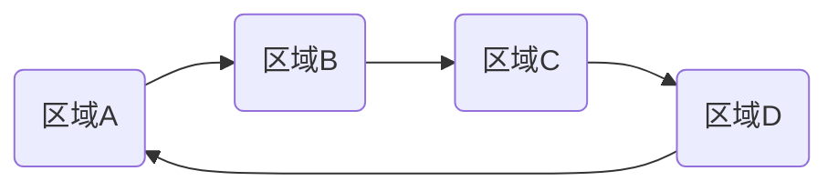

# redo log

*InnoDB引擎层*

*WAL技术: Write-Ahead Logging, 先写日志,再写磁盘.*

当需要更新数据时 InnoDB引擎会先把记录写到 redo log里面. 并更新内存,这个时候更新就算完成了.

redo log是固定大小, 从头写到尾, 循环写. 

如果还没用完固定大小,那么引擎将会在空闲的时候把数据更新到磁盘.
如果更新内容特别多,当固定大小被写完时,将会先暂停别的事情,先把数据更新到磁盘.为新纪录腾出空间.

当数据库异常重启,数据也不丢失.此称之为: **crash-safe**

**tips: <u>innodb_flush_log_at_trx_commit</u>设置为1, 表示每次redo都持久化到磁盘**

#binlog

*server层*

归档日志

//todo

**tips: <u>sync_binlog</u>设置为1,表示每次事务的bin都持久化到磁盘**

# 两个log对比

1. redo log 为InnoDB引擎特有, binlog为server层实现,所有引擎公用.
2. redo log 为物理日志(做了什么修改). binlog为逻辑日志(给xxx做xxx).
3. redo log 为循环写,固定空间会用完. binlog为可追加写入, 并不会覆盖以前的日志. 
//todo

# 两段提交

两段提交: prepare到commit

目的: **让两份日志之间的逻辑一致**

反证: 
1. 先写redo后写bin 
  写bin期间异常重启. 由于redo已经写完所以异常重启数据也已经有效.
  此时,使用binlog进行数据恢复时,临时库就少了这一次更新. 

~~Q1.这里redo是对线上库的恢复.当使用临时库替换线上库时,redo还有什么意义?~~
这样会导致主从数据库数据不一致,即主数据库正确,从数据错误. 

2. 先写bin后写redo
  写redo期间异常重启, 那么重启之后线上库是没有这条信息的.
  而后面的从数据库使用bin进行数据同步时,会写入这个信息.
  
  ~~Q1.但用bin进行恢复之后不也就可以了嘛?~~

//todo

## 数据库恢复(别人删库后跑路:)

1. 找到最近一次的全量备份, 将备份恢复到临时库.
2. 从备份时间点开始, 将备份的binlog依次取出来, 重放到删库跑路的时间.
3. 把表数据从临时库取出来,恢复到线上库. 

Q1.这里redo log的角色是什么?

