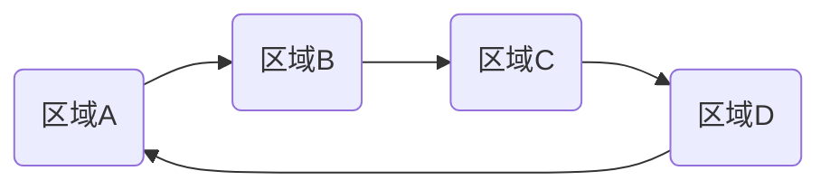

*InnoDB引擎层*

# redo log

*WAL技术: Write-Ahead Logging, 先写日志,再写磁盘.*

当需要更新数据时 InnoDB引擎会先把记录写到 redo log里面. 并更新内存,这个时候更新就算完成了.

redo log是固定大小, 从头写到尾, 循环写. 

如果还没用完固定大小,那么引擎将会在空闲的时候把数据更新到磁盘.
如果更新内容特别多,当固定大小被写完时,将会先暂停别的事情,先把数据更新到磁盘.为新纪录腾出空间.

当数据库异常重启,数据也不丢失.此称之为: **crash-safe**

